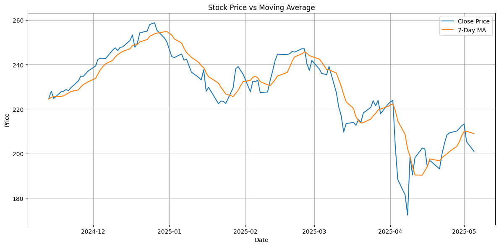

# 📈 Stock Market ETL Pipeline (Yahoo Finance)

This project demonstrates a full ETL pipeline that extracts, transforms, and loads stock market data from Yahoo Finance using Python. It also includes data visualization and database querying — ideal for showcasing ETL and data pipeline skills in your data portfolio.

---

## 🔧 Tech Stack

- Python 3
- [yfinance](https://pypi.org/project/yfinance/) – for stock data extraction
- pandas – for data transformation
- SQLite – for database storage
- matplotlib – for visualization

---

##  ETL Workflow

### 1. **Extract**
- Pull historical stock data using the `yfinance` API.
- Configurable for any stock ticker and date range.

### 2. **Transform**
- Clean column names and format timestamps.
- Engineer new features:
  - `daily_return_%`
  - `7-day moving average` (`ma_7`)
  - `volume_million` (for better readability)

### 3. **Load**
- Load the transformed data into a local SQLite database: `stock_data.db`
- Table name: `stocks`

### 4. **Visualize**
- Line chart comparing **Close Price** and **7-Day Moving Average**
- Saved to `images/stock_plot.png`

---

## 📁 Project Structure

```text
stock_etl_pipeline/
├── data/                # Optional raw or cleaned CSVs
├── images/              # Chart for README (e.g., stock_plot.png)
│   └── stock_plot.png
├── src/
│   ├── extract.py       # Extracts stock data from Yahoo Finance
│   ├── transform.py     # Cleans and adds indicators
│   ├── load.py          # Loads into SQLite
│   ├── query.py         # Queries SQLite (for debugging/validation)
│   └── main.py          # Orchestrates the ETL steps
├── stock_data.db        # SQLite database with transformed stock data
├── requirements.txt     # Python dependencies
└── README.md            # Project summary and instructions
```

---

## 💻 How to Run the Project

```bash
# 1. Clone the repository
git clone https://github.com/zuberkhan-git/stock_etl_pipeline.git
cd stock_etl_pipeline

# 2. Install dependencies
pip install -r requirements.txt

# 3. Run the ETL pipeline
python src/main.py
```

---

## 📊 Sample Output

The pipeline saves a chart comparing stock price and its 7-day moving average:



---

## 📬 Contact

Made by Zuber Khan  
Connect on [LinkedIn](https://www.linkedin.com/in/zuber-khan-5b8ab3117/)  
Feel free to fork and use!
